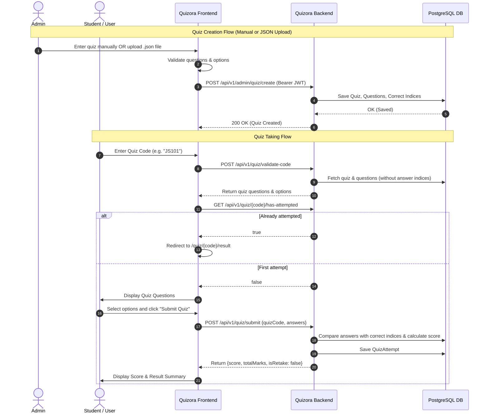

# Quizora 🧠✨

A modern, full-stack assessment and quiz platform engineered for seamless quiz authoring, secure code-based testing, and instant evaluation.

[](https://spring.io/projects/spring-boot)
[](https://openjdk.org/)
[](https://react.dev/)
[](https://www.typescriptlang.org/)
[](https://vitejs.dev/)
[](https://tailwindcss.com/)
[](https://www.postgresql.org/)
[](https://www.docker.com/)

---

## 📖 Table of Contents

- [Overview](#-overview)
- [Key Features](#-key-features)
- [Architecture & Tech Stack](#-architecture--tech-stack)
- [Monorepo Directory Structure](#-monorepo-directory-structure)
- [System Flow](#-system-flow)
- [Getting Started](#-getting-started)
  - [Prerequisites](#prerequisites)
  - [1. Backend Setup](#1-backend-setup)
  - [2. Frontend Setup](#2-frontend-setup)
  - [3. Running with Docker Compose](#3-running-with-docker-compose)
- [Quiz Creation (Manual & JSON Upload)](#-quiz-creation-manual--json-upload)
- [API Reference](#-api-reference)
- [Environment Variables](#-environment-variables)
- [Contributing & License](#-contributing--license)

---

## 🌟 Overview

**Quizora** is a robust assessment platform designed to streamline the lifecycle of online quizzes:
- **Administrators** can construct quizzes manually through an interactive UI or import them instantly by uploading standardized `.json` files.
- **Candidates/Students** join quizzes securely using unique access codes, answer questions in a distraction-free interface, and receive immediate evaluated feedback.
- **Anti-Cheat & Single-Attempt Safeguards**: Question answers and scoring indices remain secure on the server. The client only receives option texts, and once a test is submitted, retakes are strictly prevented.

---

## 🚀 Key Features

- **🔐 Role-Based Authentication**: Secure JWT-based authentication supporting both `USER` and `ADMIN` roles.
- **🎯 Unique Quiz Code Entry**: Fast and intuitive access to quizzes using simple alphanumeric codes (e.g., `JS101`, `QUIZ001`).
- **📂 JSON Quiz Import & Upload**:
  - Drag-and-drop or select any valid `.json` quiz file.
  - Live client-side schema validation with descriptive diagnostics.
  - Interactive preview showing question cards, options, and highlighted correct answers.
  - One-click direct creation or import into the manual form for fine-tuning.
  - Built-in sample template generator and download button.
- **✍️ Interactive Manual Quiz Builder**: Dynamic question forms with variable option counts, point allocations, and answer keys.
- **⏱️ Secure Server-Side Evaluation**: Correct answers are never leaked to the client browser state. Evaluation occurs strictly on the backend with tamper-proof scoring.
- **🚫 Retake Prevention**: Users are automatically restricted to one valid submission per quiz code, with attempt history saved to the database.
- **📊 Real-Time Scorecard**: Instant visual feedback displaying score, total marks, percentage, and submission timestamps.
- **🐳 Docker Ready**: Multi-stage production Dockerfiles for both backend and frontend, plus a unified `docker-compose.yml` for PostgreSQL and services.

---

## 🛠 Architecture & Tech Stack

### Backend (`quizora-backend`)
- **Language & Runtime**: Java 21 (OpenJDK)
- **Framework**: Spring Boot 4.0.2
- **Security**: Spring Security with Stateless JWT (`io.jsonwebtoken:jjwt:0.12.6`)
- **Database & ORM**: PostgreSQL with Spring Data JPA & Hibernate
- **Build Tool**: Maven (`mvnw` wrapper included)
- **Boilerplate Reduction**: Project Lombok

### Frontend (`quizora-frontend`)
- **Framework**: React 19 (TypeScript)
- **Tooling**: Vite 7
- **Styling**: Tailwind CSS v4, Radix UI primitives
- **Notifications**: Sonner (Toast notifications)
- **Icons**: Lucide React
- **HTTP Client**: Axios with automatic JWT interceptors

---

## 📁 Monorepo Directory Structure

```text
Quizora/
├── quizora-backend/                 # Spring Boot API service
│   ├── src/
│   │   ├── main/java/com/quizora/Quizora/
│   │   │   ├── config/              # Security, CORS, JWT Filter
│   │   │   ├── controller/          # REST Controllers (Auth, Quiz, Admin)
│   │   │   ├── dao/                 # Request & Response DTOs
│   │   │   ├── model/               # JPA Entities (User, Quiz, Question, QuizAttempt)
│   │   │   ├── repository/          # Spring Data Repositories
│   │   │   └── service/             # Business Logic & Evaluation Engine
│   │   └── main/resources/          # application.yml
│   ├── Dockerfile                   # Multi-stage Java build container
│   ├── docker-compose.yml           # Backend + Postgres orchestration
│   └── pom.xml                      # Maven project configuration
│
├── quizora-frontend/                # React Vite SPA
│   ├── src/
│   │   ├── api/                     # Axios API endpoints & interceptors
│   │   ├── components/              # UI Components (Cards, Buttons, Navbar, Badges)
│   │   ├── context/                 # AuthContext (JWT & session state)
│   │   ├── pages/                   # Views (SignIn, SignUp, Dashboard, QuizTaking, AdminCreateQuiz)
│   │   └── types/                   # TypeScript interfaces (Quiz, User, Auth)
│   ├── Dockerfile                   # Multi-stage Node/Serve container
│   ├── package.json
│   └── vite.config.ts
│
├── FLOW_DIAGRAM.md                  # Comprehensive end-to-end architecture flow
├── INSERT_QUIZ_USING_API.md         # Documentation for API-based quiz creation
├── QUIZ_SETUP_GUIDE.md              # System guide and test-taking workflow
├── create_quiz.py                   # Python automated insertion helper script
├── quiz_sample_template.json        # Reference JSON template for quiz upload
└── README.md                        # Project root documentation
```

---

## 🔄 System Flow



---

## ⚡ Getting Started

### Prerequisites
- **Java 21** or higher
- **Node.js 20+** and **npm**
- **PostgreSQL 15+** (or Docker)

---

### 1. Backend Setup

1. **Navigate to the backend directory**:
   ```bash
   cd quizora-backend
   ```

2. **Configure Environment Variables**:
   Create a `.env` file in `quizora-backend/` (or configure your system environment variables):
   ```properties
   DB_URL=jdbc:postgresql://localhost:5432/quizora_db
   DB_USERNAME=postgres
   DB_PASSWORD=postgres
   JWT_SECRET=bZ1C/BhnIVRROhmEch4+xyoc1wc/aI9z1J1+gxRp5qACifGl3iVz3DczLoCZz382pFsjzlXwnLvMzKaf8sPjyA==
   JWT_EXPIRATION=86400000
   FRONTEND_URL=http://localhost:5173
   ```

3. **Build and Run the Service**:
   ```bash
   # Windows
   .\mvnw.cmd spring-boot:run

   # Linux/macOS
   ./mvnw spring-boot:run
   ```
   The backend API will start on `http://localhost:8080`.

---

### 2. Frontend Setup

1. **Navigate to the frontend directory**:
   ```bash
   cd quizora-frontend
   ```

2. **Configure Environment Variables**:
   Create `.env` in `quizora-frontend/`:
   ```properties
   VITE_APP_API_URL=http://localhost:8080
   ```

3. **Install Dependencies & Start Dev Server**:
   ```bash
   npm install
   npm run dev
   ```
   The web application will be accessible at `http://localhost:5173`.

---

### 3. Running with Docker (Backend & Database)

The backend is containerized and available on Docker Hub as [`utkarshjain45/quizora-backend:latest`](https://hub.docker.com/r/utkarshjain45/quizora-backend). You can run both the backend service and PostgreSQL database without installing Java or Maven locally:

```bash
cd quizora-backend
docker compose up -d
```

- **Backend Image:** [`utkarshjain45/quizora-backend:latest`](https://hub.docker.com/r/utkarshjain45/quizora-backend) (pulled automatically from Docker Hub)
- **Backend API:** `http://localhost:8080`
- **PostgreSQL Database:** `localhost:5440` (internal container port `5432`)

Once the backend container is running, start the frontend locally:
```bash
cd quizora-frontend
npm install
npm run dev
```
Access the web app at `http://localhost:5173`.

---

## 📂 Quiz Creation (Manual & JSON Upload)

Admins can access `/admin/create-quiz` through the navigation bar menu.

### Required JSON Format
When using the **Upload JSON** feature or calling the Admin API, upload a file adhering to the following structure:

```json
{
  "code": "JS101",
  "title": "JavaScript Fundamentals",
  "description": "Core assessment on JS variables, scoping, and data types",
  "questions": [
    {
      "questionText": "What does JSON stand for?",
      "options": [
        "JavaScript Object Notation",
        "JavaScript Oriented Notation",
        "Java Standard Object Network",
        "JavaScript Online Node"
      ],
      "correctAnswerIndex": 0,
      "points": 1
    },
    {
      "questionText": "Which keyword declares a block-scoped variable?",
      "options": ["var", "let", "def", "dim"],
      "correctAnswerIndex": 1,
      "points": 1
    }
  ]
}
```

> **Rules & Notes:**
> - `code`: Unique alphanumeric identifier across the platform.
> - `correctAnswerIndex`: `0`-indexed integer pointing to the correct option (`0` = 1st option, `1` = 2nd option, etc.).
> - `options`: Array of strings containing at least 2 non-empty options.
> - `points`: Optional positive integer (defaults to `1` if omitted).

---

## 📡 API Reference

### Authentication (`/api/v1/auth`)
| Method | Endpoint | Description | Auth Required |
|---|---|---|---|
| `POST` | `/api/v1/auth/signup` | Register a new user | No |
| `POST` | `/api/v1/auth/login` | Authenticate and receive JWT token | No |

### User (`/api/v1/users`)
| Method | Endpoint | Description | Auth Required |
|---|---|---|---|
| `GET` | `/api/v1/users/me` | Fetch authenticated user profile | User (Bearer) |

### Quiz Taking (`/api/v1/quiz`)
| Method | Endpoint | Description | Auth Required |
|---|---|---|---|
| `POST` | `/api/v1/quiz/validate-code` | Validates code and loads question list | User (Bearer) |
| `POST` | `/api/v1/quiz/submit` | Submits answers and computes score | User (Bearer) |
| `GET` | `/api/v1/quiz/{code}/attempt` | Retrieves score and result for current user | User (Bearer) |
| `GET` | `/api/v1/quiz/{code}/has-attempted` | Checks if user already completed the quiz | User (Bearer) |

### Admin (`/api/v1/admin/quiz`)
| Method | Endpoint | Description | Auth Required |
|---|---|---|---|
| `POST` | `/api/v1/admin/quiz/create` | Create a quiz via JSON payload | Admin (Bearer) |
| `POST` | `/api/v1/admin/quiz/upload` | Create a quiz via Multipart `.json` file upload | Admin (Bearer) |

---

## ⚙️ Environment Variables

### Backend (`quizora-backend/.env`)
| Variable | Description | Example |
|---|---|---|
| `DB_URL` | JDBC URL for PostgreSQL database | `jdbc:postgresql://localhost:5432/quizora_db` |
| `DB_USERNAME` | Database username | `postgres` |
| `DB_PASSWORD` | Database password | `postgres` |
| `JWT_SECRET` | Base64-encoded secret key for signing JWTs | `bZ1C/...` |
| `JWT_EXPIRATION` | Token validity duration in milliseconds | `86400000` (24 hrs) |
| `FRONTEND_URL` | Allowed origin for CORS | `http://localhost:5173` |

### Frontend (`quizora-frontend/.env`)
| Variable | Description | Example |
|---|---|---|
| `VITE_APP_API_URL` | Base URL of the Quizora backend API | `http://localhost:8080` |

---

## 🤝 Contributing & License

1. Fork the repository
2. Create your feature branch (`git checkout -b feature/AmazingFeature`)
3. Commit your changes (`git commit -m 'feat: Add some AmazingFeature'`)
4. Push to the branch (`git push origin feature/AmazingFeature`)
5. Open a Pull Request

Distributed under the MIT License. See `LICENSE` for more information.
